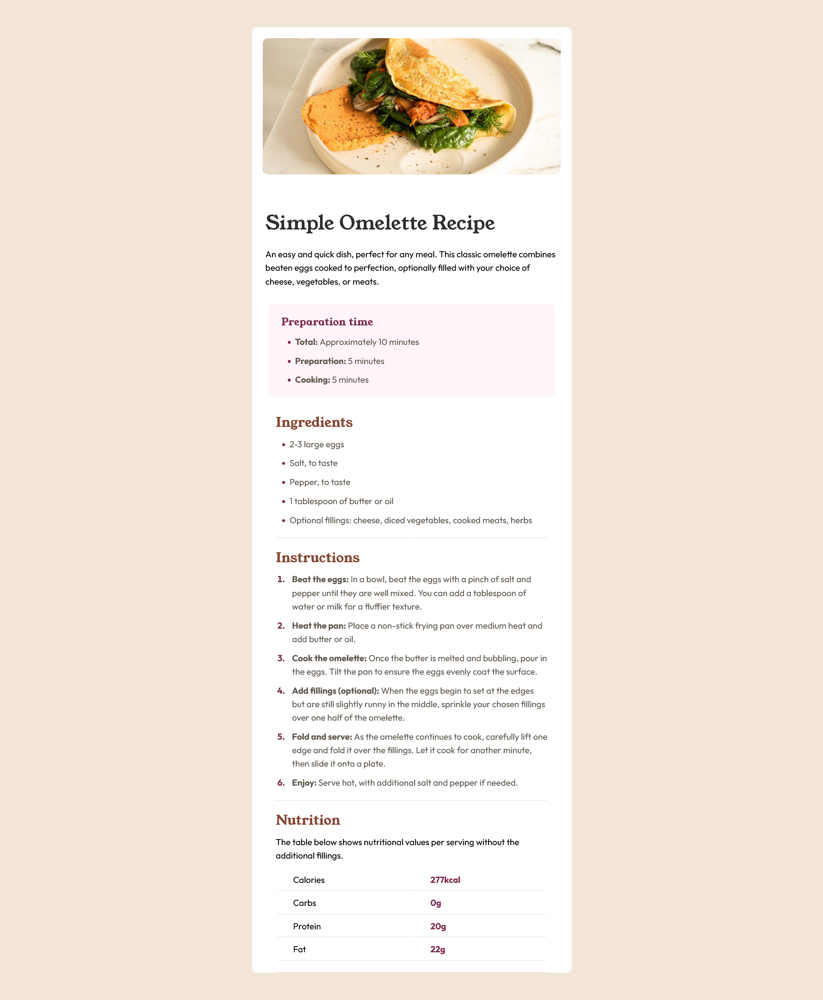

# Frontend Mentor - Recipe page solution

This is a solution to the [Recipe page challenge on Frontend Mentor](https://www.frontendmentor.io/challenges/recipe-page-KiTsR8QQKm).

## Table of contents

- [Overview](#overview)
  - [Screenshot](#screenshot)
  - [Links](#links)
- [My process](#my-process)
  - [Built with](#built-with)
- [Author](#author)

## Overview

### Screenshot

### Links

- Solution URL: [My live site URL](https://github.com/basemsameh/Recipe-page.git))
- Live Site URL: [My live site URL]([https://your-live-site-url.com](https://basemsameh.github.io/Recipe-page/))

## My process

### Built with

- Semantic HTML5 markup
- Table
- Unordered and ordered lists
- CSS custom properties

## Author

- Linkedin - [Basem Sameh](https://www.linkedin.com/in/basem-sameh-671b5b212/)
- Frontend Mentor - [@basemsameh](https://www.frontendmentor.io/profile/basemsameh)
